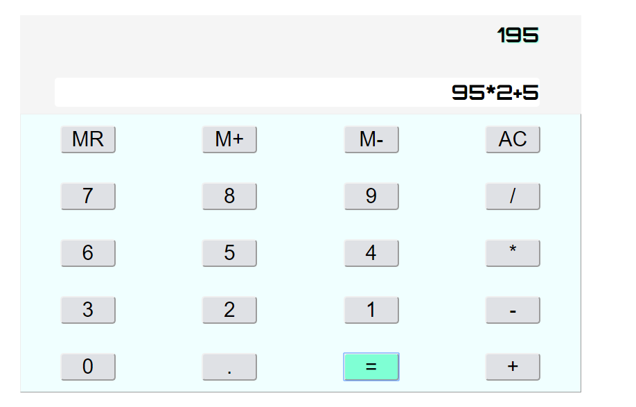

## SNAKE App

**_SNAKE app in Vanilla Javascript and HTML + CSS_**

Demo [here](http://mastermind-snake.herokuapp.com/)

### Summary

Fourth app done in my roadmap to become a fullstack web developper.
This is snake app with instructions and customization.

You can tune the difficulty level and compete to beat the record.

The game engine in coded in Vanilla javascript. Front end and styling are done with **Bootstrap** and **CSS grid** 

Building a simple game always looked daunting for me. But as i learned the basics of canvas, coding the game was finally smooth.
This was a very good exercise for me to work on writing a concise code by using functions. 

### Author

**_Gilchrist TOSSOU_** - Full stack web developer/ data engineer [LinkedIn](https://linkedin.com/in/gilchrist-tossou-a9663743/)

